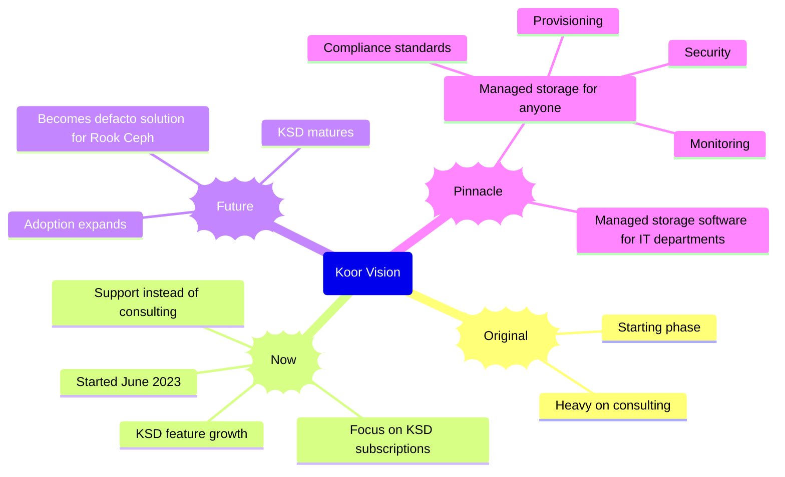

# About Koor

## What we do

Koor helps people who manage their own Ceph data storage. We develop and sell software that makes it easier to navigate the complexity of Rook and Ceph, to prevent problems, and to resolve issues when they occur.

## Mission

Koor's mission is to make self-managed Rook and Ceph data storage easier to use. We aspire to build expertise into our software products. We want Koor products to be the obvious choice for people who manage their own data storage systems.

Koor is a start-up that must earn its right to exist. We believe in the opportunity to improve the experience of those who adopt open source. By making Ceph and Rook more accessible, we will help grow the open source community. Our relationship is symbiotic.

## Vision

Imagine a future where Koor is one of a few dominant players in the data storage space. Koor serves the data management needs of customers, whether they want to control data themselves or have Koor handle it for them. Koor gives customers control over all types and uses of data storage.

This is a big vision. Maybe too big. Let's accomplish this in stages from the beginning through the next 3 to 5 years.

### Mindmap of Company Vision

### 1. Original Phase - Consulting

Koor helps customers with Rook Ceph data storage through consulting engagements. We help customer with only Ceph, too. That is a reflection of what we are doing.

**_As of July 2023, we are moving to the next stage._**

### 2. Now - Koor Comes of Age

Koor offers subscriptions to the Data Control Center:

- Free trial - up to 4 nodes with limited support.
- Pro - 4+ nodes with unlimited support, include an initial system assessment.
- Enterprise - for bulk discounts and optional labor-intensive support programs, which come for an additional cost.

Coming of age means that we have found customers who see the value of what we have to offer and made the effort to adopt our solution. When we are adding a dozen or more customers per week, that will be able to accelerate to the next phase.

### 3. Future - Koor is the Solution of Choice

The Koor Data Control Center (KDCC) has enough useful features to merit higher subscription prices. Expertise is built into the product and easy to apply. Support is still unlimited but relied on less and less as KSD becomes more useful. KDCC is the go-to add-on software for anyone running Rook Ceph.

### 4. Pianncle - Koor offers self-service data storage

Koor uses KDCC to run data storage on behalf of customers who want to outsource the effort. Customer can take over whenever they like without surprises or having to migrate data. The same controls can be operated by a customer's IT staff.

The software automates self-service provisioning by authorized users. It also provides NOC-style operational controls and handles all types of administration and maintenance. The solution is certified for various levels of regulatory compliance.

## History of the company

Koor was born on 18 March 2022. The Alexander Trost was the founding engineer. Over the next year, Alexander assembled a team of data storage experts: Gaurav, Deepika, Zuhair, and Javier. At some point Gaurav left. In April 2023, Dave Mount agreed to join. He started as CTO on May 8.

Koor has attracted a dozen or so customers who needed help with their data storage. Some only use Ceph and some use both Rook and Ceph. The Koor Storage Distribution (KSD) was the sole product offering for a while. One customer subscribed to a KSD Pro license in June 2023.

During the summer of 2023, Koor started working on the Data Control Center. The idea is to materialize the "data control plane" into a GUI with a backing microservice that interacts on the user's behalf with Kubernetes and Ceph. This is a work in progress.

The rest is yet to come.

## Open source stewardship statement

We love open source. In fact, Koor is one of the maintainers of the [Rook](https://rook.io) project. The Koor team contributes by picking up and resolving issues.

## And more…

[Culture](culture)
[Communication](communication)
[Goals](goals/annual2024)
[Employees](employees/)
[Company Holidays](holiday-policy)
