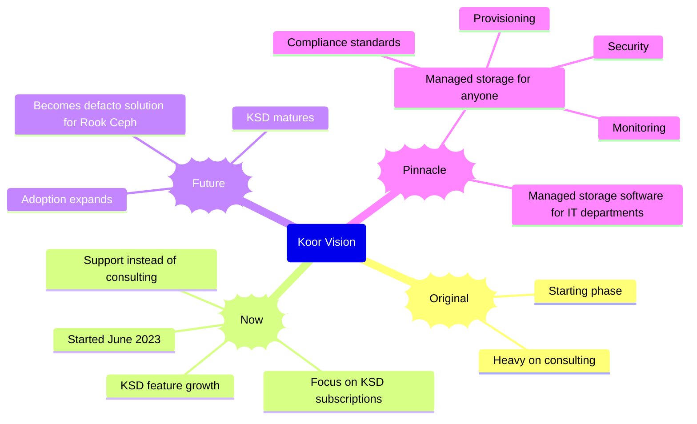

# Vision

Imagine a future where Koor is one of a few dominant players in the data storage space. Koor serves the data management needs of customers, whether they want to control data themselves or have Koor handle it for them. Koor gives customers control over all types and uses of data storage.

This is a big vision. Maybe too big. Let's accomplish this in stages from the beginning through the next 3 to 5 years.

## Mindmap of Company Vision

## Original - Consulting

Koor helps customers with Rook Ceph data storage through consulting engagements. We help customer with only Ceph, too. That is a reflection of what we are doing.

*As of July 2023, we are phasing out this approach in favor of the next stage.*

## Now - KSD Comes of Age

Koor offers KSD subscriptions: Trial (up to 4 nodes with limited support), Pro, and Enterprise. With a Pro or Enterprise subscription, customers get unlimited support with their Rook Ceph data storage. Enterprise customer have enough volume to merit discounts. The KSD is licensed per node.

## Future - KSD is the Solution of Choice

KSD has enough useful features to match or exceed to subscription price. Expertise is built into the product. Support is still unlimited but relied on less and less as KSD becomes more useful. KSD is the go-to add-on software for anyone running Rook Ceph.

## Pianncle - Koor offers self-service data storage

Koor uses KSD and our team of experts to run data storage for customers who would like to outsource. The advantage of using Koor is that it is Rook Ceph. The customer can take over whenever they like. We also offer the tools for enterprise customers to manage data self-service for their internal users.

