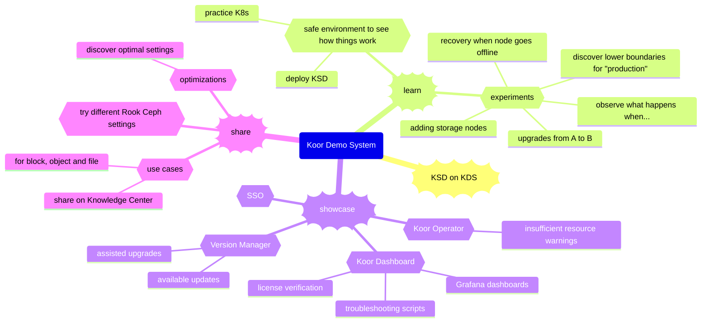

# Demo System Vision Mindmap

This is one way to visualize the purpose of the demo system when it reaches maturity.

```mermaid
mindmap
  root(Koor Demo System)
    ksd ))KSD on KDS((
    learn ))learn((
        safe {{safe environment to see how things work}}
            practice K8s
            deploy KSD
        exp {{experiments}}
            observe what happens when...
            discover lower boundaries for "production"
            upgrades from A to B
            adding storage nodes
            recovery when node goes offline
    show ))showcase((
        op {{Koor Operator}}
            insufficient resource warnings
        dash {{Koor Dashboard}}
            Grafana dashboards
            license verification
            troubleshooting scripts
        ver {{Version Manager}}
            available updates
            assisted upgrades
        sso {{SSO}}
    share ))share((
        set {{try different Rook Ceph settings}}
        opt {{optimizations}}
            discover optimal settings
        use {{use cases}}
            for block, object and file
            share on Knowledge Center
```
