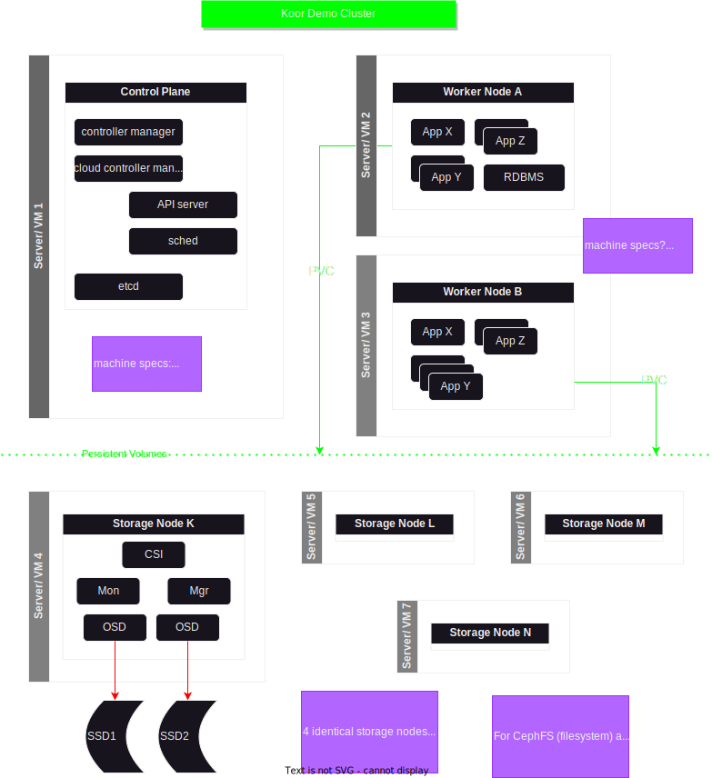

# Demo System Overview

## Purpose

We are creating a demonstration system for three major reasons.

1. We need hands-on experience designing, building, and running distributed K8s environments using Rook Ceph for data storage. Typical "Getting Started" guides are insufficient for gaining experience with what our customers have to support.
2. We need a way to prove out use cases that the KSD supports and to show our work to customers.
3. We need a way to run meaningful experiments in an environment that can be adapted to match what customers do, or at least follow similar patterns.

The environment should support real applications that make use of data. The demo needs to be big enough and configured completely enough that it shows correct patterns -- running 4 or more nodes, spreading pods across nodes, using proper security, etc. On the other hand, we are not trying to discover the outter limits of Ceph or Rook scalability. Cost is still a consideration.

When complete, the demo system should be spun up and down through automation. In fact, the more of this kind of automation we put into KSD, but better our chances of selling to big customers.

## Features we want to showcase

This a list of specific points that the demo system needs to handle. Let's add everything we can think of to the list. If it gets long, we can organize into sublists. In any case, we will group the requirements into development milestones.

1. Include the yaml for setting up the K8s cluster.
   1. Should we allow for different size environments?
      1. Could start with a single machine/VM, but that's not right for production. 
      2. Maybe we start at a 3-machine minimum. 
      3. We recommend 4 nodes, so should those be across 4 machines/VMs?
   2. Would be nice to pick from a library of configuration patterns that match common use cases.
2. Use the latest KSD release to set up Rook Ceph.
   1. Great if installation is automated.
3. Add applications that represent what real users will want to do and the data those applications need.
   1. Some kind of database.
   2. A CDN serving a static website and its assets: HTML, CSS, Javascript, images.
   3. A streaming service for video, sound.
4. Show backup and recovery as one of the features of the environment, with Rook Ceph as the storage for backups.
5. ...and more... please add more ideas

## System design

**Note: This may take many iterations to work out.**

Here's a diagram of the demo system.

(This is in draw.io [here](https://app.diagrams.net/#G1Es8ikJ0fN7b4BJiUpxWnaxQPSSkZK5Mg). Dave is the owner.)

While drawing this picture, lots of questions come to mind.

1. The picture shows a minimum of 6 servers, including 3 servers dedicated to Ceph storage. Is that really the minimum? We recommend 4, so would we need Storage Node N to live up to our recommendation?
2. Should each storage node have a minimum of 3 drives? Or is enough to have one per node?
3. How much data capacity will the "smallest production system" have?
4. What is missing from this diagram?
5. What is wrong with the diagram?

## Implementation details

For short experiments, EC2 on AWS is attractive -- maybe. The per-hour cost is low if you only need the VM for a few hours. However, after a few days, the cost breaks even with the monthly cost of VMs from Hetzner.

From what I could tell without spending any money, Hetzner charges for the full month on provisioning. So using a VM for a few hours (just to practice or if the wrong specs are provisioned) would end up wasting money. Granted, it's a small amount per server. Times 6, times how many drives.

Better to get the design right (as least as much as we can figure out) before building.

And we'll make mistakes, so that's the cost of learning.

### Holy wars (and I'm not talking about anyone's religion)

1. What flavor of Linux should we use?
2. Which container: containerd or CRI-O?
3. Which databse (as a demo app): Postgres, MySQL, Hadoop...?
4. kubeadm or minikube?
5. any other big choices to make?

