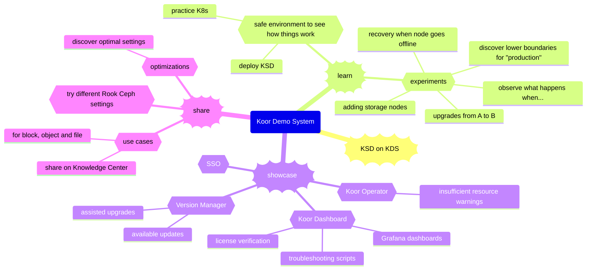

# Demo System Vision Mindmap

This is visualization of the ways we can use our demo system.

## Mindmap

## Learn

First and foremost, this demo is a great way to learn about the Kubernetes environment and the components that have to work together. Building and running the system is the best way to gain practical experience with the challenges that come with working with so much complex technology.

* Kubernetes is complex
* Ceph is complex
* Networking is complex
* Security is complex

Putting them all together is even more challenging. Keeping things running under various pressures and stresses of usage is another challenge. Diagnosing and fixing problems is a third. Our demo system needs to reflect a realistic production system, even if it is at the small end of things in terms of size.

The demo system is a safe place to try things. Anyone who really wants to learn can follow the procedures to set up a new system, and help care for the system we have running.

Also, this is a great basis for experimentation. Start from the known stable system and see what happens with various changes. Try an upgrade either by hand or using the Koor Version Manager (someday). Try adding storage capacity. See what happens when a node is shut down, then restored. There is no limit to the number of real-world situations we can try using our demo system.

## Showcase

One of the most important uses of our demo system will be...wait for it...to *demonstrate* how KSD helps manage Rook Ceph data storage. We will use the system to show what KSD can do. We will start with a simple demo since KSD is just getting started. Over time, the demo will become more elaborate and impressive.

This may be the single most important factor in convincing people to adopt KSD.

## Share

Closely related to learning and experiments is our ability to set up various use cases for Ceph-managed data. The configuration for each use case can be copied from the demo system into our Knowledge Base. We can also include configuration pattern in KSD that customers can apply to their environments with a click or two. Easy setup, quick tuning.
