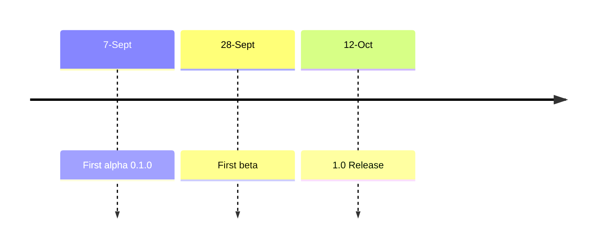

# Product Roadmap

**Last updated:** 31 August 2023

[Previous road map here](./product-roadmap-previous.md)

## Koor Data Control Center

Koor's primary product offering is the Koor Data Control Center. This product includes a collection of software projects that work together to make Rook Ceph data storage as easy as possible.

(Internally, we may use the acronyms, KDCC or DCC, but for our website and marketing efforts, we need to spell it out. Data Control Center is immediately understandable, as opposed to DCC or KDCC.)

The Data Control Center is a materialization of the data control plane, which more of an abstract notion. The Data Control Center has everything you need to see what is happening with your data storage systems and to make changes as needed.

It's a single-pane-of-glass view that provides a common user interfaces for many perspectives of data storage operation. It is also offers GUI-based controls for setting up data storage, for tuning a running system, and to assist with larger modifications, like upgrades, expansion, and migrations.

The Data Control Center provides a browser-based user interface to view operating metrics of Rook and Ceph, and to assist with system changes. The UI is backed by APIs for microservices that do the heavy lifting. The services are hosted in the same environment as the data, giving them the access to available information.

Components of the control center include:

- Koor Storage Distribution (KSD)
  - Koor's fork of Rook that is kept at parity with the latest version.
  - Includes supplemental proprietary code for Koor users.
- Koor Operator
  - Installs KSD on any Kubernetes cluster, and sets up Rook Ceph storage
  - Uses Helm chart or CRDs to define storage
  - Checks the status of storage, flagging the user when resources are below minimum thresholds
- Version service
  - Compares installed and latest versions of software
  - Flags the user when Ceph and Rook upgrades can be applied
  - _(future)_ Enables scheduled and one-click system upgrades for non-breaking upgrade paths
- Diagnostic scripts
  - Gathers debugging information from a running cluster for troubleshooting issues
- Extended Ceph Exporter
  - Extends metrics exported from Promethius for improved utilization charts

## Control Center Feature Areas

The Data Control Center UI is organized into the following feature areas.

### Dashboard

- A top-level view that shows critical system metrics and active alerts.
- High-level operational charts with drill-downs to see the details of each subsystem.
- Versions of Ceph, Rook, and installed extensions, with information about available updates.

### Charts and Gauges

- A comprehensive array of metrics displayed for quick visibility.
- Many of the metrics have drill-downs to see details.

### Koor Controls

- Control panels with editable fields for properties that can be modified for system tuning.
- Staging for changes that require restart.
- Scrubbing schedules to ensure deep scrubbing happens frequently enough.

### Data Storage Set-up and Expansion

- Koor Operator and Helm chart for installing the Koor Storage Distribution.
- A selection of templates to match common use cases.
- Automated system upgrades.
- SSO integration.

### Troubleshooting Tools

- Diagnostic scripts to gather data to help pinpoint issues.

## MVP and Milestones

We do not know what a minimum-viable product is. Instead, we will focus on a series of milestones. As the rate of adoption starts to soar, we might look back point to where the Data Control Center reached MVP status.

As of August 31, we are working to go live with the Data Control Center as it stands.

### First Alpha release - 0.1.0

Our first release will be an alpha with a few capabilities that work in a limited fashion. The first alpha includes:

- Authentication to gain access to the data cluster
- A dashboard view of some key metrics of the system (real data)
- A card view of the software versions obtained from our live version service

### Alpha versions

Getting alpha 0.1.0 live is just the beginning. That will allow early adopters to try the software and give us feedback. We also have more features to add to reach beta status.

For each alpha release, we will increment the minor version by 1. So 0.2.0 would follow 0.1.0.

### First Beta release - 0.N.0

Once we have all of the features defined here, that will be our first beta release. We will stay in beta until we resolve any blocking issues and any bugs that cause serious problems.

The features for beta include working features that establish a basis for future expansion:

- Authentication
- Dashboard with key metrics, including software versions
- At least one control panel that lets users change system parameters one-by-one
- Automated upgrades
- An interface for applying a named set of changes that suit a particular use case
  - Choose a simple pattern

### 1.0 Release

We will reach this milestone when beta features are working.

## Timeline

Our timeline will be tight. We need to hurry without rushing. In other words, we should optimize by accomplishing fewer things and doing them reasonably well.

